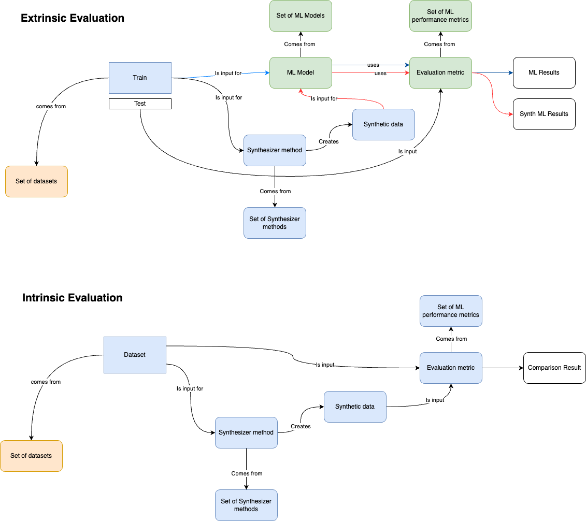

# PrivGen: A Human-in-the-Loop Tool for Improving the Privacy of Synthetic Data

PrivGen is a tool designed to enhance the privacy of synthetic data through a human-in-the-loop process. While still in the development phase, the tool is implemented in a series of Jupyter notebooks for demonstration and evaluation purposes.

## Notebooks Overview

1. **[privgen_example.ipynb](./notebooks/privgen_example.ipynb)**  
   This notebook demonstrates the application of PrivGen on a given dataset, resulting in the creation of synthetic data.

2. **[privgen_evaluation.ipynb](./notebooks/privgen_evaluation.ipynb)**  
   As the name suggests, this notebook evaluates the synthetic data generated in the previous step using various metrics. (*Note: This notebook is computationally intensive and may not be suitable for local execution.*)

3. **[privgen_results_figures.ipynb](./notebooks/privgen_results_figures.ipynb)**  
   This notebook generates visualizations of the evaluation results. The output includes publication-ready figures saved in the `results_figures` directory.

## Utilities

To streamline the process, all the required functions for running the application and evaluation are modularized in Python files located in the `./utils` directory.

## Evaluation Pipeline

Below is the suggested evaluation workflow:

## Quick Start Guide

Follow these steps in sequence to use PrivGen:

1. **Run `privgen_example.ipynb`:**  
   Apply the PrivGen method to a dataset of your choice. This step generates synthetic data and saves the results.

2. **Run `privgen_evaluation.ipynb`:**  
   Evaluate the generated synthetic data using a variety of metrics. This step produces tabular comparison data, which can be found in the `results` directory.

3. **Run `privgen_results_figures.ipynb`:**  
   Generate evaluation figures and visualizations. These results are saved as PDF files in the `results_figures` directory.