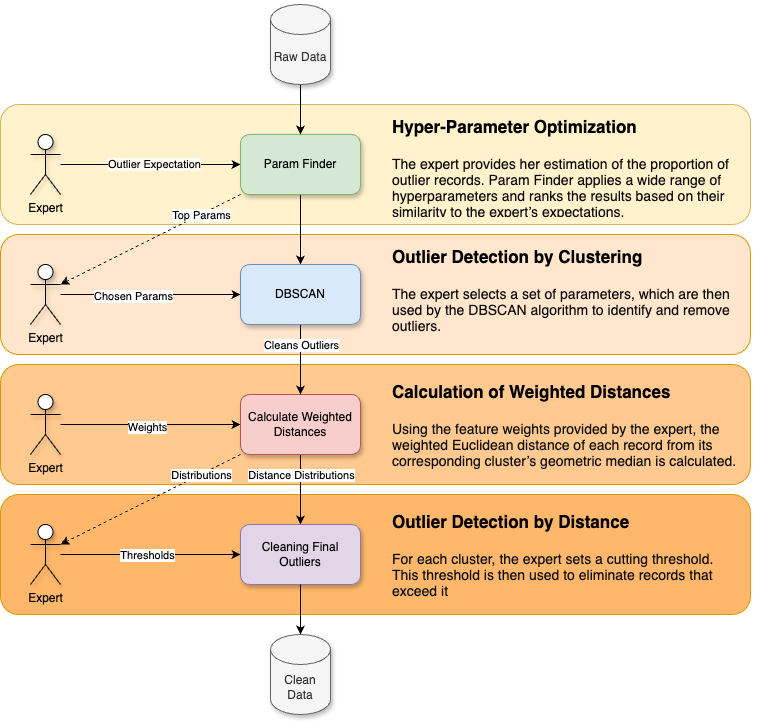

# PrivGen: A Human-in-the-Loop Tool for Improving the Privacy of Synthetic Data



PrivGen is an expert-guided preprocessing pipeline that sanitises privacy-risky outliers
before a synthetic-data generator is trained. It combines density-based clustering
(DBSCAN) with weighted distances to per-cluster geometric medians, and trims tail points.

> This repository is the reproduction package for the paper: pipeline code, the exact
> per-stage artefacts, and the attack-based evaluation. See *Findings* below.

## Notebooks

1. **`notebooks/privgen_example_<dataset>.ipynb`** — applies PrivGen end-to-end and writes
   the sanitised table. One per studied dataset: `cervical`, `german`, `health`.
2. **[privgen_evaluation.ipynb](./notebooks/privgen_evaluation.ipynb)** — evaluates the synthetic data (computationally heavy).
3. **[privgen_results_figures.ipynb](./notebooks/privgen_results_figures.ipynb)** — publication figures into `results_figures/`.

Run them in that order. The heavy evaluation was executed on AWS via
`notebooks/evaluate_privegen_AWS_<dataset>.py`.

Reusable functions live in `./utils`.

## Pipeline artefacts

`data/<dataset>_<step>_*.csv` records every stage:

| step | contents |
|---|---|
| 1 | encoded input |
| 2 / 3 | kept by DBSCAN / removed as DBSCAN noise |
| 4 | per-record weighted distance to its cluster's geometric median |
| 5 / 6 | kept after distance trimming / removed by it |
| 8 | decoded sanitised table (the input to the synthesiser) |

## Validation experiments

### `appendix_d/` — attack-based evaluation
48 attribute-inference runs across all three datasets, plus the saved synthetic samples
(`appendix_d/synth/`). Membership inference (DOMIAS) is scaffolded but not swept — see
*Open* below.

That directory carries its own README with resume instructions.

## Findings

**Sanitisation deleted an entire minority class.** On Cervical Cancer all 54
biopsy-positive records are removed — at the DBSCAN stage, which the paper's proposed
per-class cap does not cover. Attribute-inference attacks on that dataset are therefore
degenerate: the sensitive attribute is constant in the synthetic data.

**Attribute inference gains are small.** The attacker's advantage over a majority-class
baseline falls only modestly with PrivGen (e.g. Health `smoker` +0.097 -> +0.074) and
*rises* for German credit risk (-0.026 -> +0.025).

**Two metric directions were wrong.** `inv_kl_divergence` and `ks_test` both return
higher-is-better in synthcity and had been scored as lower-is-better.

**Everything is single-seed.** Two arms whose removal sets agree at Jaccard 0.97 differ
by 0.11 in improvement rate — so seed noise alone is worth about 0.1, and differences
below that should not be read as real.

## Open

- **Membership inference (DOMIAS).** Harness in `appendix_d/scripts/run_mia.py`. The
  KDE and prior variants fail on Cervical Cancer with a singular covariance; the BNAF
  variant runs. Not yet swept.
- **Multi-seed repetition**, which the noise floor above makes a prerequisite for any
  quantitative claim.

## Environment

```bash
python3.11 -m venv .venv_synth
.venv_synth/bin/pip install synthcity 'opacus==1.4.0'   # newer opacus needs torch>=2.4
```
`MPLBACKEND=Agg` is required or every worker opens a GUI window. PATE-GAN fails to
terminate on some sanitised tables and is excluded where noted.
